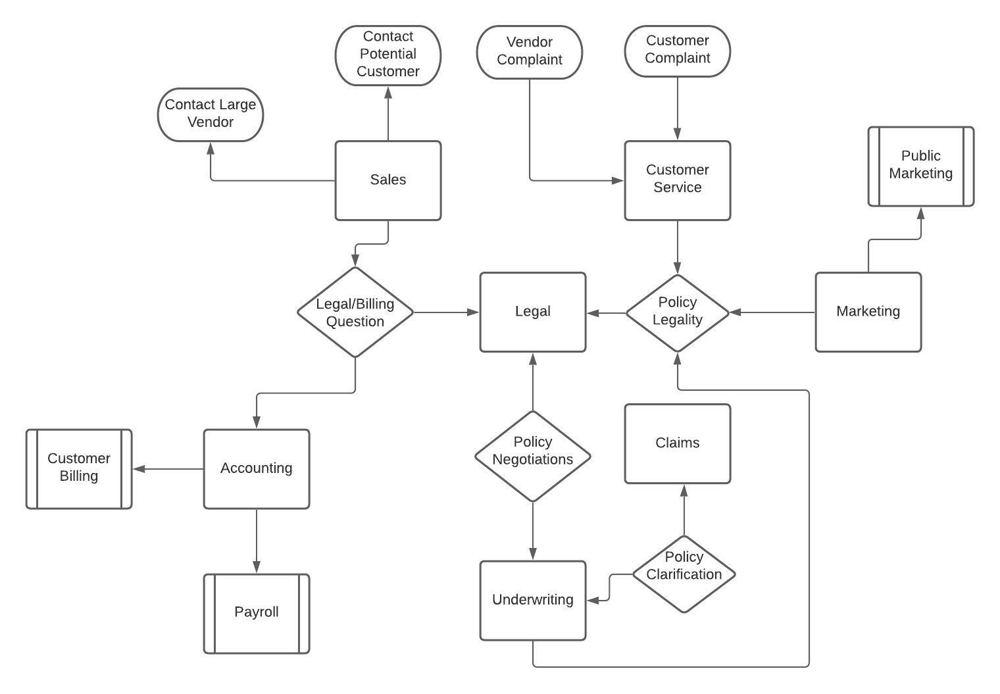
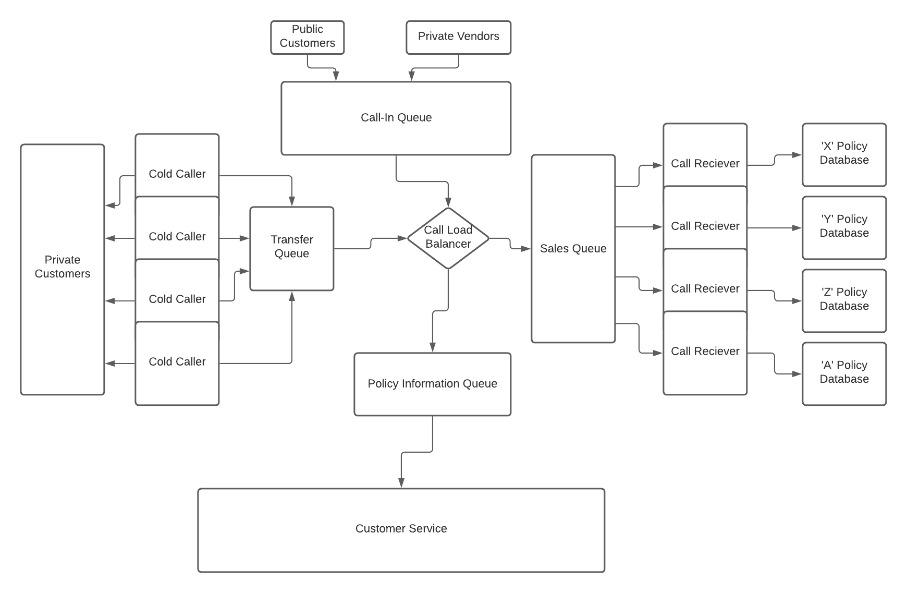

# Business Opportunity

My business opportunity is a fully-online insurance company. I think that moving insurance to 
100% online will greatly reduce overhead, as you will not have to pay for as many buildings, less employees over all, and customer acquisition will be much faster. As well as that, this might be even better recieved in a world that has dealt with COVID-19 for almost 2 years. Online businesses are booming right now.

## Customer Service

This is the department that will directly deal with customer complaints, support tickets, and general relations. It is one of two departments that will deal with customers, both through email and on the phone. Since ideally our business will grow to be quite large, this team will have to be very efficient in dealing with complaints as well as be quite large personnel-wise. Ideally, this department will have operators on live phone lines ready for customer questions, as well as an automated email distribution system to distribute complaints evenly amongst workers to that they can be seen to quickly and efficiently.

## Sales

Sales is the second and last department with direct customer or vendor contact. This will be almost entirely phone-based, as selling insurance through a chatbot or form submission is not a reliable way to ensure the correct policy is being discussed for a customer or vendor. This will probably be the largest department, since to make money in insurance, you actually have to sell clients policies. It will also be split into two major sub-departments: cold-callers and call-recievers. COld callers are sales reps that go out and contact potential customers to try and sell them an insurance policy they may need. Their expertise will be more general, focusing more on informing potential customers rather than finishing a sale. If a customer is interested, they will be transferred to a call-reciever. Call recievers are the reps who actually finish policy sales, and are much more specific in their expertise. Call recievers will also recieve calls from independantly interested clients who are trying to purchase insurance as well.

## Legal

The legal department at an insurance company deals not with customer claims, but acts more like a referee for all the departments. An insurance lawyer might answer legal questions from customer service, or negotiate insurance settlements/litigate bad faith cases on behalf of the claims department. Obviously, court cases happen in person so while the bulk of this company is online, the lawyering will have to be done in person. Any department that might deal with a customer however, is fully online.

## Accounting

The acounting department will deal with any and all transactions that occur at this business. That includes but is not limited too payroll, billing customers, company acquisitions etc. This is definitely the simplest department to describe since there is not a whole lot going on at any one time, but the small variation in services provided all require a large amount of work due to the nature of large companies.

## Claims

The claims department will process any and all insurance claims that insured customers submit. This differs from the legal department because they will not actually litigate cases where customers are refusing their claim decision. They will instead take in requests from customers, and then attempt to resolve said claim with the least cost to the company. This deparment is a major profit driver, as the less the company has to pay out in insurance claims the more money the company has from policy payments.

## Marketing

The marketing department will work very closely with the sales department in order to get word out of the insurance company as well as some specifics of the policies being offered. These include but are not limited to radio ads, TV commercials, poster campaigns, billboards and many more ways of marketing the companies services. Clearly, sales will have to be up-to-date on marketing campaigns that relate to their area of expertise. Ideally, this department will bring in a large amount of customers that will then be processed by sales and customer support.

## Underwriting

THe underwriting department actually writes and rewrites insurance policies that will be serviced by customer service and sold by sales. This department is the heart and soul of any insurance company. It will also 'butt heads' with the marketing department, since the goal of these insurance policies is to avoid resolving claims in favour of the customer, while the marketing team's goal is to make the policies sound favourable + affordable. Of course, at the end of the day both departments are just trying to sell insurance, but the specific goals of each are contradictory.

## Deep Dive

The team I performed my deep dive on was the Sales team. The reason I chose this team is because it has multiple moving parts, and the call-in nature of online insurance selling lends itself to an MSA design. Each policy sales rep will have access to a database for their specific policy information. This is actually an example of a bounded context, since to a customer a policy might just be a policy name or policy ID, to a sales rep a policy might be a set of rules or declarations, and to the call balancer the policy would be a mapping to a rep or set of reps that specialize in that policy. It is important to note that a single call reciever block represents a fleet of reps that are associated by the policy they specialize in. 

